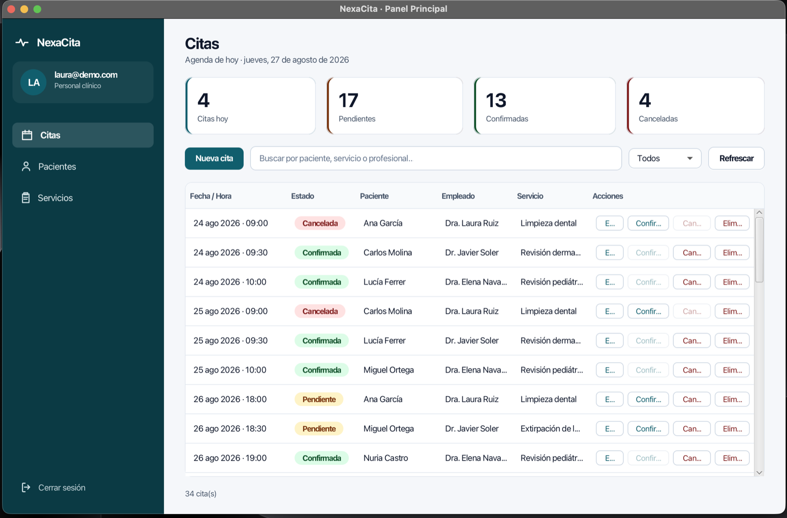
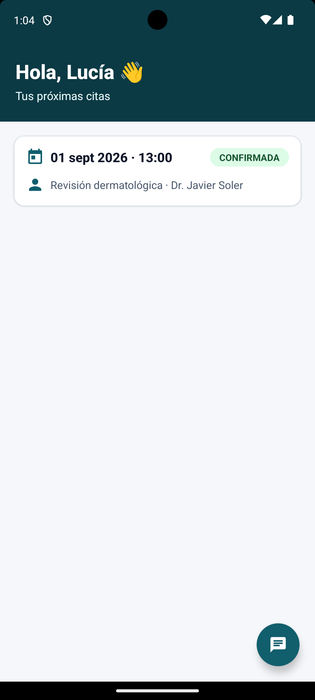
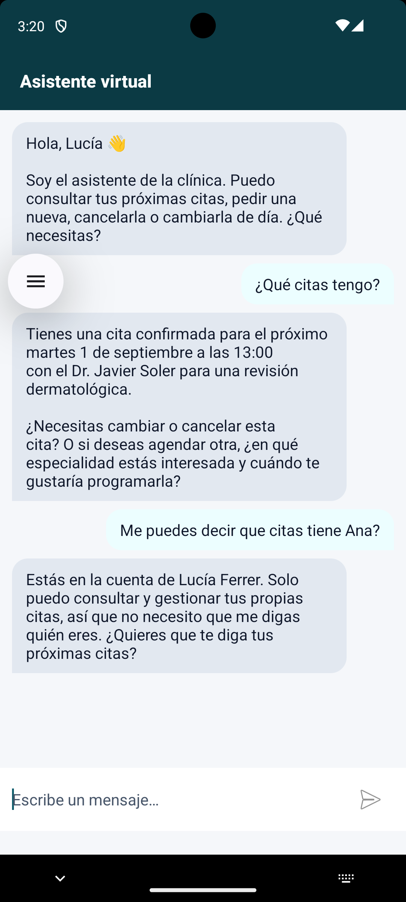
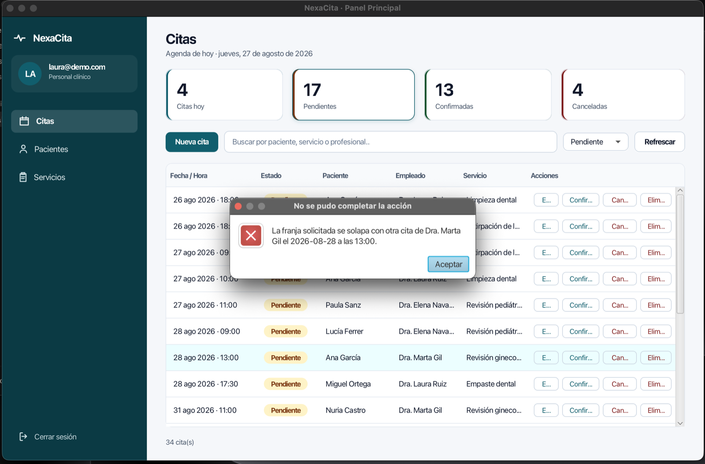
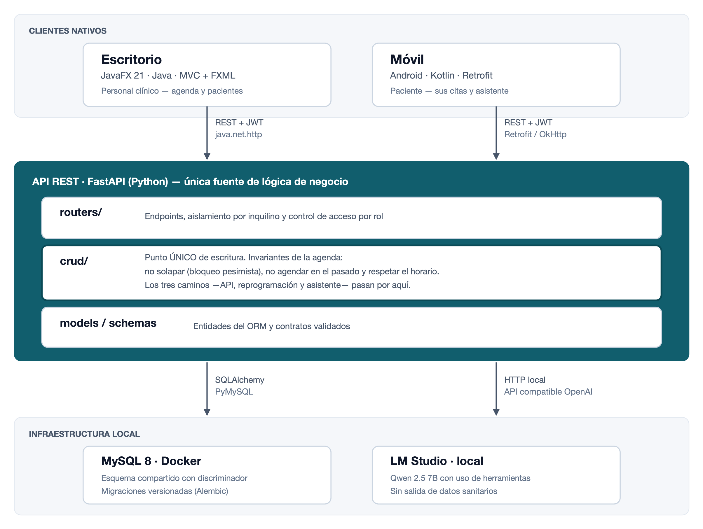

# NexaCita

**Gestor de citas SaaS multi-inquilino para clínicas médicas, con asistente conversacional.**

Una sola instalación da servicio a varias clínicas sin que sus datos lleguen a tocarse. El personal trabaja desde una aplicación de escritorio y el paciente desde el móvil, ambas contra la misma API. El asistente virtual reserva, cancela y reprograma citas en lenguaje natural, sometido exactamente a las mismas reglas que la interfaz.

Proyecto de fin de ciclo del CFGS en Desarrollo de Aplicaciones Multiplataforma.

---

## Capturas

**El panel de la clínica.** Los cuatro indicadores son además botones: al pulsarlos filtran la tabla.



**La aplicación del paciente.** Sus próximas citas y el asistente, que opera con sus mismos permisos y no acepta que le digan ser otra persona.

<p align="center">
  
  
</p>

**Y cuando el sistema rechaza una cita**, el aviso no es genérico: dice con qué profesional y a qué hora se produce el conflicto.



---

## Arquitectura



Los dos clientes son nativos, están escritos en lenguajes distintos y **no comparten una sola línea de código**. Eso es deliberado: obliga a que el contrato de la API sea autosuficiente de verdad.

La API es el único componente con acceso a la base de datos y al modelo de lenguaje.

| Módulo | Tecnología | Para quién |
|---|---|---|
| [`backend-api/`](backend-api/) | Python · FastAPI 0.128 · SQLAlchemy 2.0 · MySQL 8 | — |
| [`frontend-desktop/`](frontend-desktop/) | Java 21 · JavaFX 21 · Maven | Personal de la clínica |
| [`frontend-mobile/`](frontend-mobile/) | Kotlin · Android (minSdk 26) · Retrofit | Paciente |
| [`database/`](database/) | MySQL 8 sobre Docker | — |

---

## Lo que tiene de particular

**Multi-inquilino desde el primer día.** Base de datos compartida con discriminador de empresa. Cada consulta se acota al inquilino del token; no se confía en una única comprobación central.

**Un solo punto de escritura para la agenda.** Las tres invariantes —no solapar, no agendar en el pasado y respetar el horario de apertura de cada clínica— viven juntas en `crud_cita`. Los tres caminos que pueden crear una cita (API, escritorio y asistente) pasan obligatoriamente por ahí, así que la regla es inevitable se llegue por donde se llegue.

**Concurrencia real.** El solapamiento no se comprueba y ya: la consulta bloquea las filas dentro de la transacción. Dos peticiones simultáneas por la misma franja producen exactamente una cita. Hay una prueba con seis hilos y conexiones separadas que lo verifica, y se ejecuta contra MySQL —no contra un motor embebido— porque fuera de InnoDB ese bloqueo no haría nada y la prueba pasaría sin ejercitar nada.

**El asistente no tiene privilegios.** Ejecuta cinco herramientas acotadas, con la identidad del paciente del token y nunca la que diga la conversación. Todo identificador que llega del modelo se resuelve contra la base de datos y se comprueba que le pertenece. Y tres salvaguardas en código revisan la respuesta antes de entregarla: nunca confirma una escritura que falló, nunca omite los datos que consultó y nunca pide al paciente que se identifique.

**Accesibilidad medida, no estimada.** Todo el texto de ambas aplicaciones alcanza el nivel AAA de contraste (7:1), con una única excepción documentada. Los ratios están anotados junto a cada color en la hoja de estilos.

---

## Puesta en marcha

Requisitos: Docker, Python 3.9+, JDK 21 y Android Studio. Opcionalmente [LM Studio](https://lmstudio.ai) para el asistente.

```bash
# 1. Base de datos
cd database
cp .env.example .env          # define MYSQL_ROOT_PASSWORD
docker compose up -d

# 2. API
cd ../backend-api
python -m venv venv && source venv/bin/activate
pip install -r requirements.txt
cp .env.example .env          # rellena DATABASE_URL y SECRET_KEY
alembic upgrade head          # OBLIGATORIO antes del seed
python seed.py
uvicorn app.main:app --reload
```

La API queda en `http://localhost:8000`, con la documentación interactiva en `/docs`.

```bash
# 3. Cliente de escritorio
cd frontend-desktop && ./mvnw clean javafx:run
```

Para el móvil, abre `frontend-mobile/` en Android Studio y ejecútalo en un emulador de API 26 o superior. Apunta a `10.0.2.2:8000`, que es como el emulador ve el `localhost` del anfitrión.

El detalle de cada paso está en [`backend-api/README.md`](backend-api/README.md) y, más extenso, en el anexo de instalación de la memoria.

### Credenciales de demostración

El seed crea **dos clínicas**, lo que permite comprobar el aislamiento: desde una no se ve absolutamente nada de la otra. Todas las cuentas usan la contraseña `password123`, deliberadamente trivial por tratarse de datos de prueba.

| Cuenta | Perfil |
|---|---|
| `laura@demo.com` | Administradora de Clínica Demo |
| `sara@demo.com` | Personal de recepción |
| `ana@demo.com` | Paciente — para la aplicación móvil |
| `marco@spa.com` | Administrador de la **segunda** clínica |

> Las citas de ejemplo se generan alrededor de la fecha actual. Si el panel aparece vacío, vuelve a sembrarlas con `python seed.py --reset`.

---

## Pruebas

```bash
cd backend-api && pytest
```

**78 pruebas** sobre las invariantes del sistema: solapamiento y concurrencia, control de acceso, registro de clínicas, unicidad de correo, aislamiento entre inquilinos, herramientas del asistente, horario de apertura y listado de citas.

Se ejecutan contra un esquema aparte del mismo MySQL, nunca contra un motor embebido, y ese esquema se construye aplicando las migraciones: cada ejecución valida además que estas producen un esquema correcto.

---

## Documentación

| | |
|---|---|
| [Memoria técnica](docs/Memoria_Tecnica.docx) | 36 páginas: arquitectura, decisiones, verificación, limitaciones y manuales |
| [Modelo entidad/relación](docs/diagrama_er.png) | Obtenido del esquema real de la base de datos |
| [Casos de uso](docs/casos_uso.png) | Actores y capacidades, derivados de las guardias de los 29 endpoints |

---

## Limitaciones conocidas

Están recogidas en el capítulo 15 de la memoria. Las principales:

- El registro de clínicas es público y no tiene limitación de frecuencia ni verificación de correo.
- El correo identifica a una persona en toda la plataforma, de modo que no puede ser paciente de dos clínicas.
- Al eliminar un paciente se borran sus citas; lo procedente en un entorno clínico sería una baja lógica.
- No hay registro de auditoría de las acciones del asistente.
- El panel de escritorio carga los listados completos en memoria en lugar de filtrar en el servidor.

El sistema se ha desarrollado y validado en un entorno local. **No está preparado para tratar datos reales de salud**: eso exigiría resolver antes las obligaciones del RGPD para datos de categoría especial, que se detallan en la memoria.
